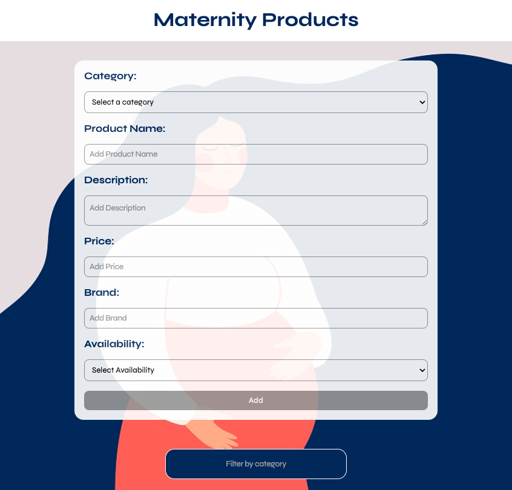
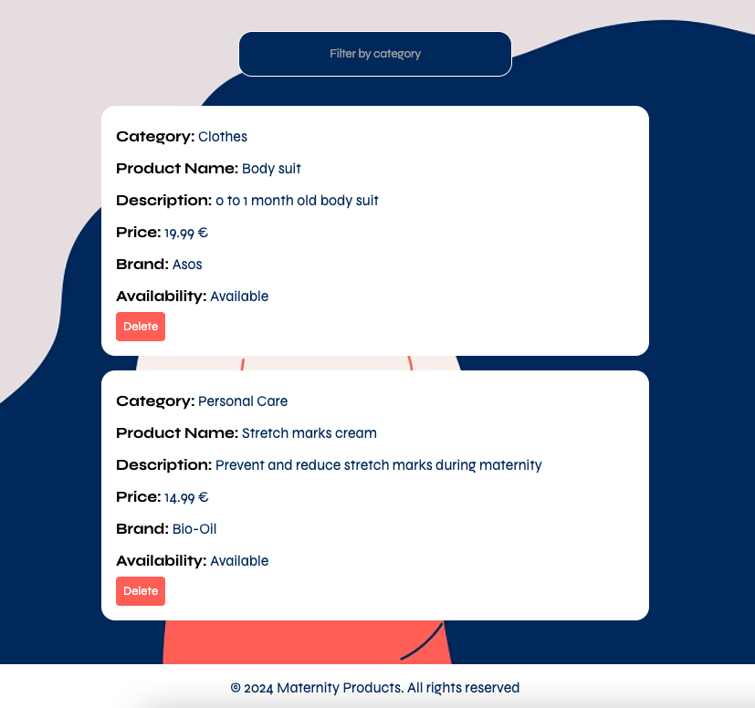

# Maternity Products App

This is a React application designed to manage and display a list of maternity products. Users can add new products, filter the product list by category, and delete items. The app includes a form for entering product details and a list view for displaying the products.

## Features

- Add new products with details including category, name, description, price, brand, and availability.
- Filter products by category.
- Delete products from the list.

## Technologies Used

- React
- JavaScript
- CSS Modules
- React Hooks (useState)

## Installation

To get started with this project, follow these steps:

1. Clone the repository:

   ```bash
   git clone https://github.com/yourusername/maternity-products-app.git
   cd maternity-products-app
   npm install
   npm start
   ```

## Usage

### Adding a Product

1. Fill in the product details in the form on the main page.
2. Select a category from the dropdown menu.
3. Enter the product name, description, price, brand, and availability.
4. Click the "Add" button to submit the form and add the product to the list.

### Filtering Products

- Use the filter input field to filter products by category.

### Deleting a Product

- Click the "Delete" button next to a product to remove it from the list.

## Contributing

Contributions are welcome! Please follow these steps:

1. Fork the repository.
2. Create a new branch (`git checkout -b feature-branch`).
3. Make your changes.
4. Commit your changes (`git commit -am 'Add new feature'`).
5. Push to the branch (`git push origin feature-branch`).
6. Create a new Pull Request.

## License

This project is licensed under the MIT License - see the [LICENSE](LICENSE) file for details.
